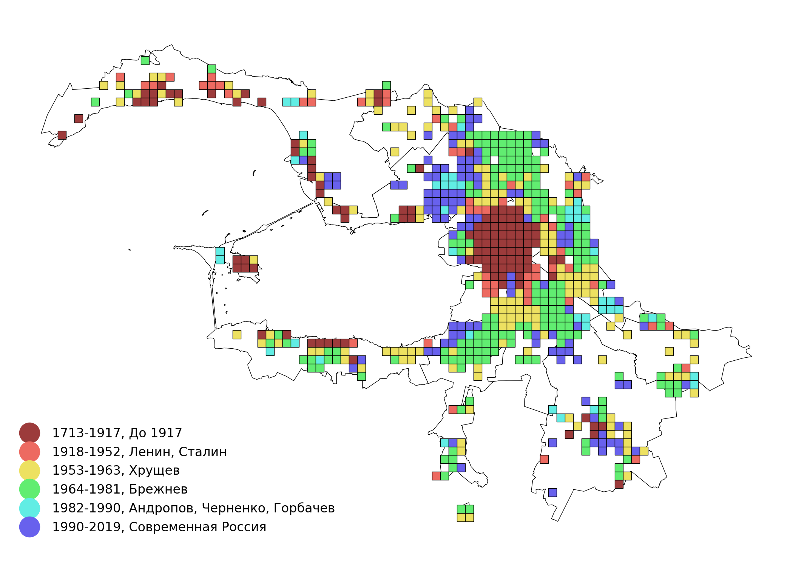
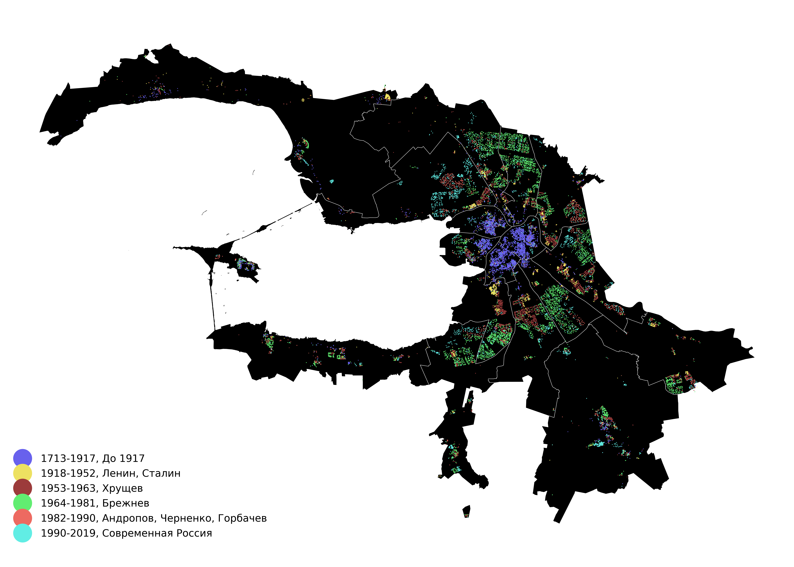
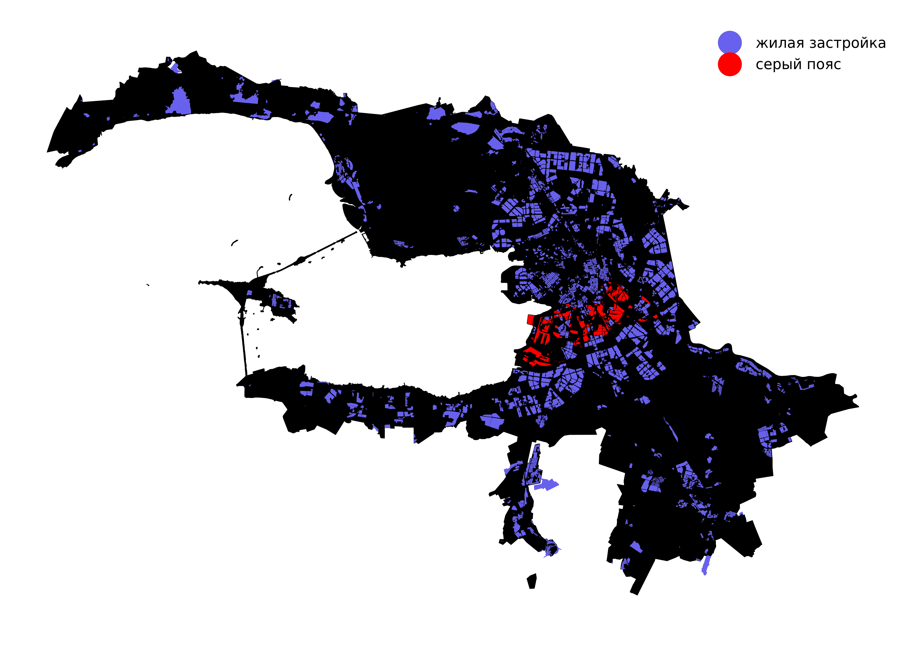
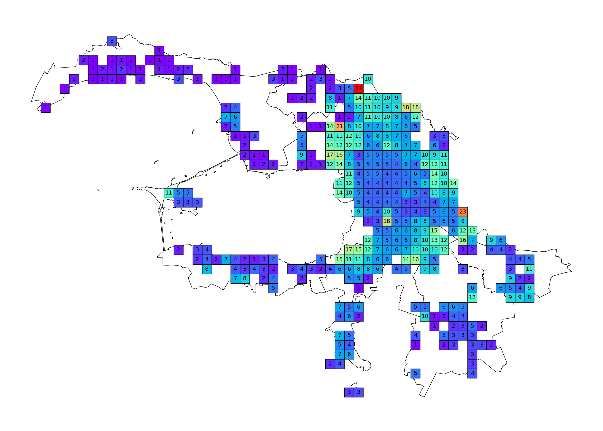
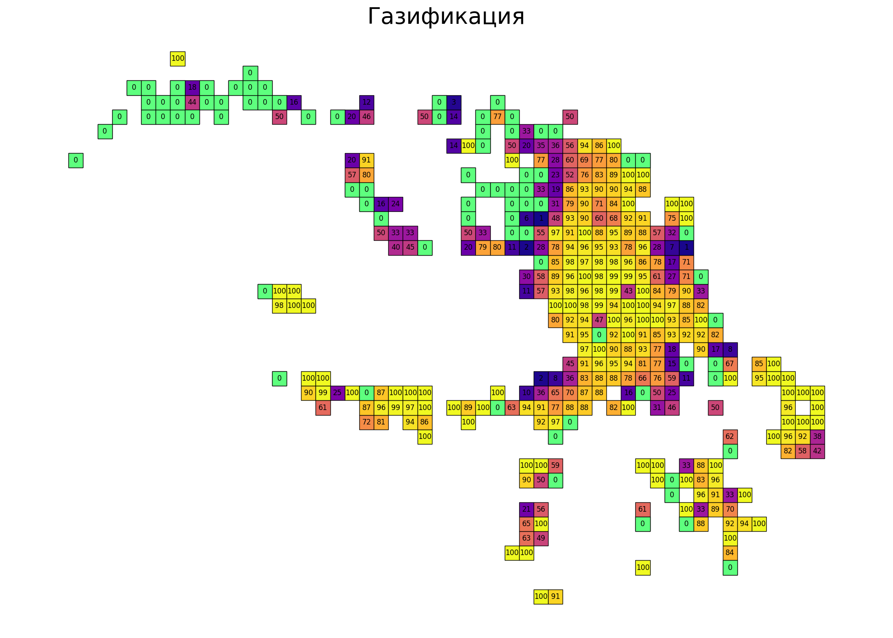

# Жилье Санкт-Петербурга

5 карт о жилом фонде Санкт-Петербурга. На картах представлены данные многоквартирных домов.

__Ресурсы:__

Мы попытались сделать проект более открытым и использовать только свободные источники и технологии:
- [Открытые данные Санкт-Петербурга](https://data.gov.spb.ru/opendata/7840013199-passports_houses/)
- [OpenStreetMap](https://www.openstreetmap.org) 

__Периоды возведения.__ Преобладающий период возведения для домов внутри квадрата сетки с шагом 1000 метров.

Более детально

__Серый пояс.__ Зона старой промышленной застройки за Обводным каналом.

__Этажность.__ Этажность домов, усредненная по квадратам сетки с шагом 1500 метров.

__Газификация.__ Процент домов имеющих доступ к централизованному газоснабжению. Рассчитан по квадратам сетки со стороной 1500 метров.

[карты в полном разрешении здесь](https://github.com/WGussev/StPHousing/blob/master/imgs)