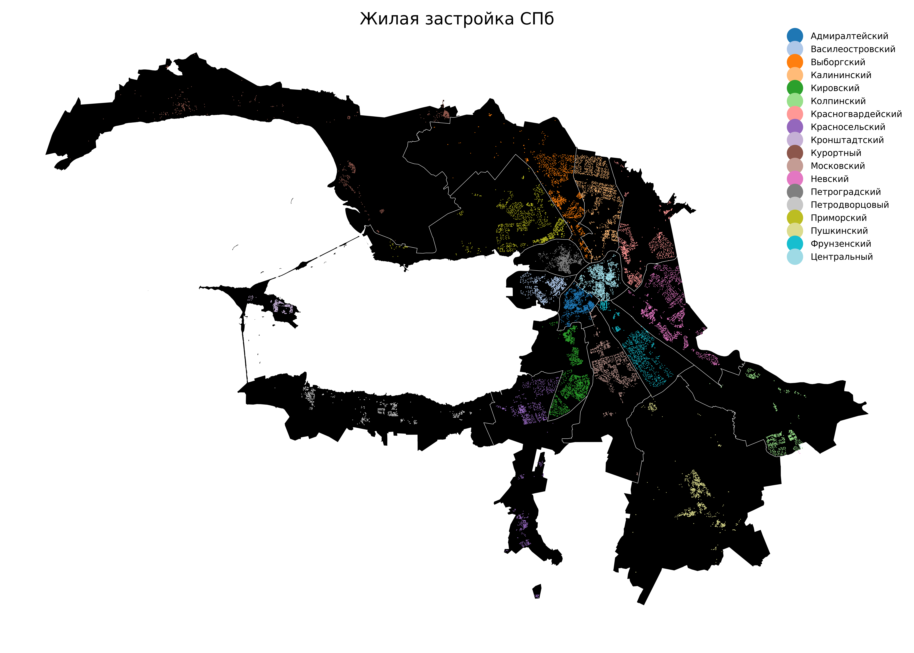

# Жилье Санкт-Петербурга

6 карт о жилом фонде Санкт-Петербурга

__Ресурсы:__

Мы попытались сделать проект более открытым и использовать только свободные источники и технологии:
- [Открытые данные Санкт-Петербурга](https://data.gov.spb.ru/opendata/7840013199-passports_houses/)
- [OpenStreetMap](https://www.openstreetmap.org)

__Застройка__

Еще более детально: можно скачать https://github.com/WGussev/StPHousing/blob/master/imgs/buidings.png

__Периоды возведения__

Более детально

Еще более детально: можно скачать https://github.com/WGussev/StPHousing/blob/master/imgs/buiding_periods.png

__Этажность__

__Газификация__

