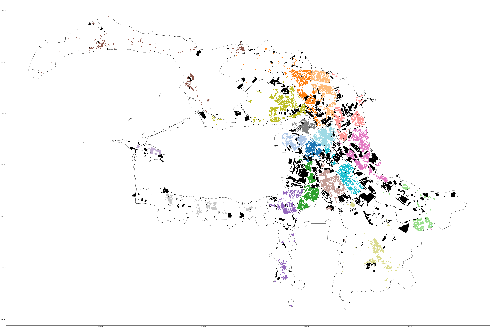

# Дома СПб

__Мы попытаемся наглядно представить ответы на вопросы:__
- Как рос город?
- Где же сосредоточны все коммуналки: на Васильевском или Петроградской?
- Какие районы чаще всего ремонтируют?
- Где дома выше?
- и некторые другие

__Ресурсы:__
Мы попытались сделать проект как можно более открытым и использовать только свободные источники и технологии:
- [Открытые данные Санкт-Петербурга](https://data.gov.spb.ru/opendata/7840013199-passports_houses/)
- [OpenStreetMap](https://www.openstreetmap.org)

